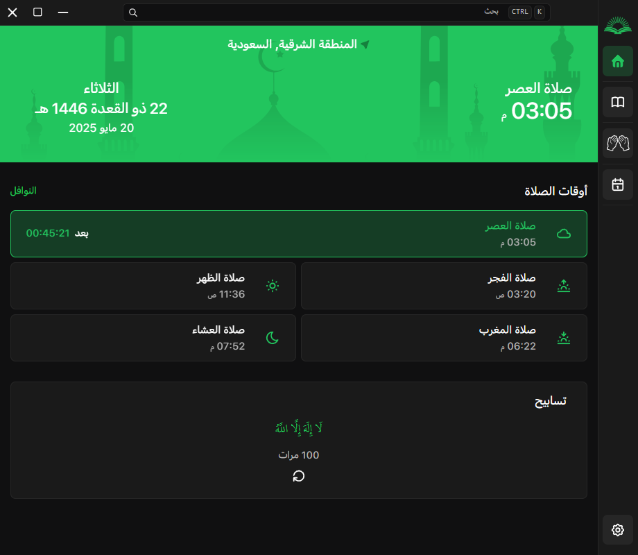
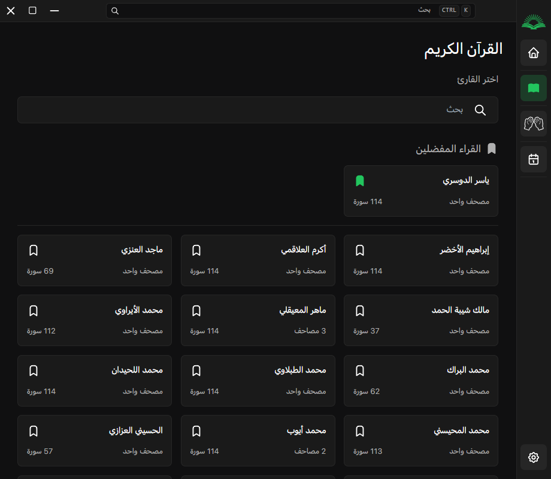
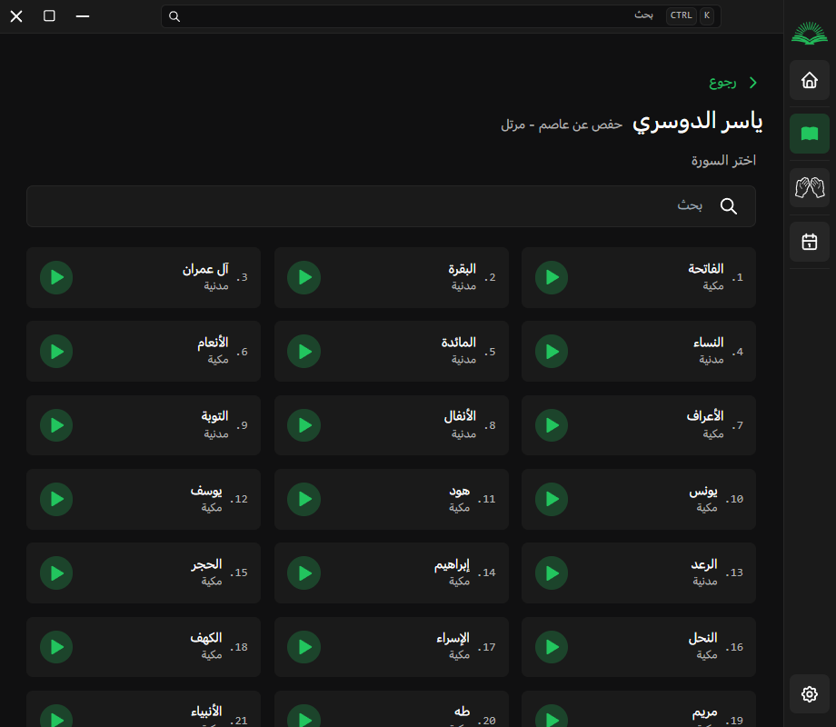
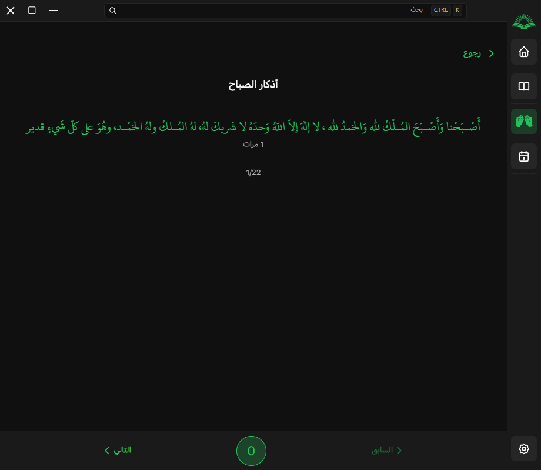
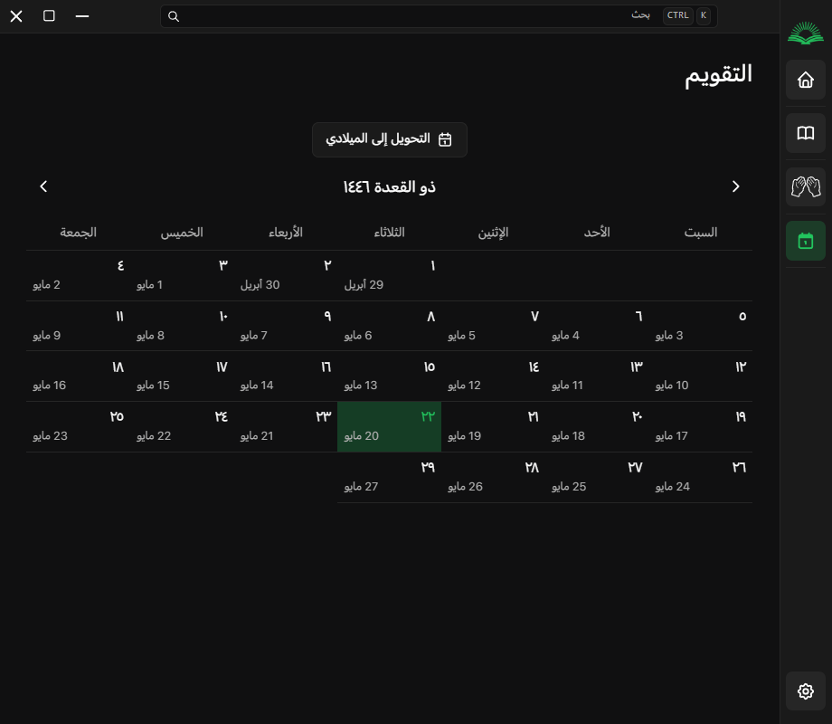
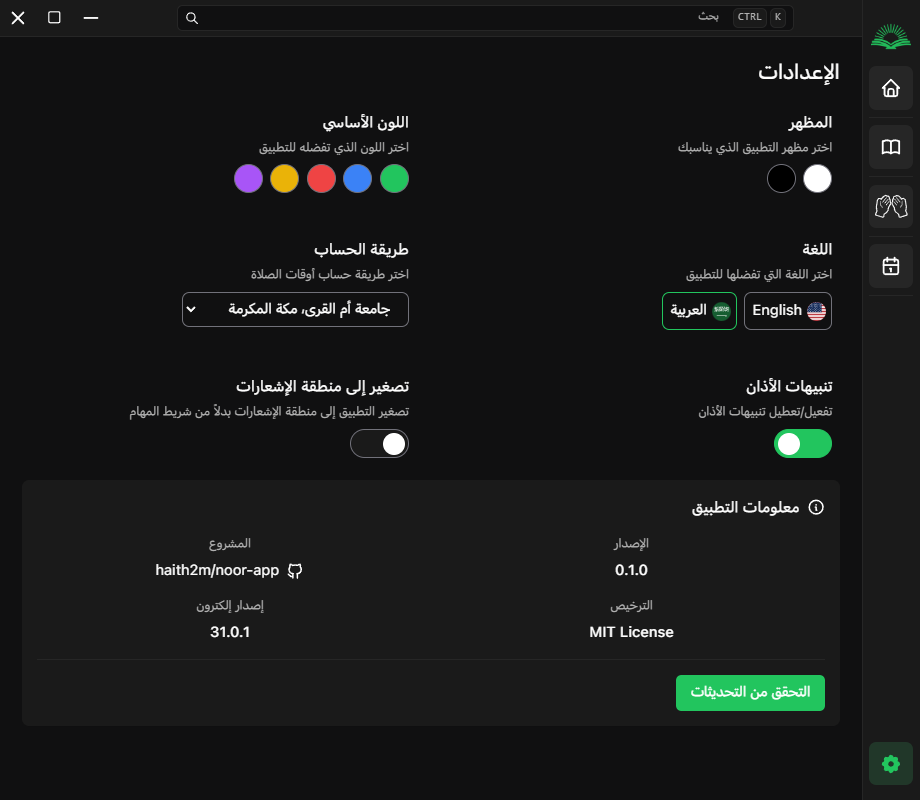

# 🌙 نور – تطبيق سطح مكتب إسلامي

**نور** هو تطبيق سطح مكتب مفتوح المصدر لتقديم تجربة إسلامية متكاملة للمستخدمين. يوفر لك مواقيت الصلاة بدقة، أذكارًا يومية، إمكانية الاستماع للقرآن الكريم، بالإضافة إلى تقويم هجري أنيق. التطبيق يدعم اللغتين العربية (كلغة أساسية) والإنجليزية.

---

## ✨ المميزات

- حساب وعرض **مواقيت الصلاة** بدقة حسب موقعك
- تنبيهات عند دخول وقت الاذان
- قسم **أذكار** الصباح والمساء وغيرها
- **مشغل صوتي** للاستماع للقرآن الكريم
- إمكانية الاختيار بين **عدة قراء** للقرآن
- **التقويم الهجري** مع عرض التاريخ الميلادي
- **إشعارات للأذان** في الوقت المحدد
- دعم كامل للغتين **العربية** و**الإنجليزية**
- تصميم جميل وسهل الاستخدام

---

## 📸 صور من التطبيق

### 🕋 الواجهة الرئيسية

  

<kbd>
    
</kbd>
  

### 📖 الاستماع للقرآن

  

<kbd>
    
    
</kbd>
  

### 📿 الأذكار

  

<kbd>
    
    
</kbd>

  

### 📅 التقويم الهجري

  

<kbd>
    
</kbd>
  

### ⚙️ الإعدادات

  

<kbd>
    
</kbd>
  

---

## ⚙️ التثبيت والتشغيل

يمكنك تحميل أحدث إصدار من التطبيق عبر ملف التثبيت **Installer** من صفحة [Releases](https://github.com/haith2m/noor-app/releases) الخاصة بالمشروع.

## 🛠️ مبني باستخدام

- [ElectronJS](https://www.electronjs.org/)
- [ReactJS](https://react.dev/)
- [TailwindCSS](https://tailwindcss.com/)

---

## 🌍 الترجمة

يدعم التطبيق اللغتين:

- 🇸🇦 العربية (اللغة الأساسية)
- 🇺🇸 الإنجليزية

---

## 🤝 المساهمة

ارحب بجميع المساهمات لتحسين التطبيق! سواء كانت في:

- تحسين الواجهة
- إضافة مزايا جديدة
- إصلاح مشاكل
- تحسين الترجمة

### خطوات المساهمة:

1. قم بعمل Fork للمشروع
2. أنشئ فرعًا جديدًا
3. أضف تعديلاتك
4. أرسل Pull Request

---

## 📄 الترخيص

تم ترخيص هذا المشروع تحت رخصة [MIT](./LICENSE) مخصصة – حر في الاستخدام والتعديل والتوزيع, بشرط ذكر المطور او رابط المشروع الأصلي.
